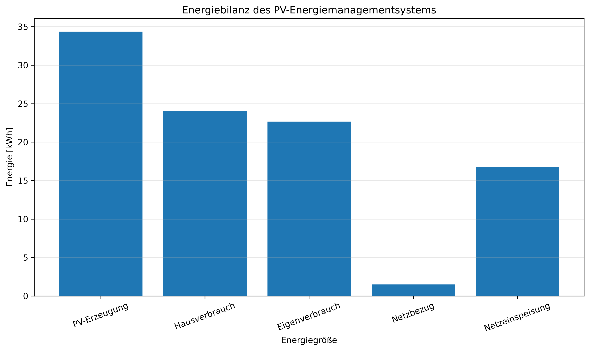

# PV-Energiemanagementsystem

## Automatischer Simulationsbericht

Erstellt am: 08.08.2026 15:16

---

## 1. Projektbeschreibung

Dieser Bericht dokumentiert die Ergebnisse der Simulation eines PV-Energiemanagementsystems mit Batteriespeicher, Hausverbrauch und Netzanschluss.

## 2. Simulationsergebnisse

| Kennzahl | Wert | Einheit |
|---|---:|---|
| PV-Erzeugung | 34.37 | kWh |
| Hausverbrauch | 24.09 | kWh |
| Direkter Eigenverbrauch | 8.88 | kWh |
| Batterie geladen | 8.79 | kWh |
| Batterie entladen | 13.79 | kWh |
| Netzbezug | 1.49 | kWh |
| Netzeinspeisung | 16.72 | kWh |
| Eigenverbrauchsanteil | 65.97 | % |
| Autarkiegrad | 94.09 | % |

## 3. Bewertung

Die simulierte PV-Anlage erzeugte 34.37 kWh Energie. Der Hausverbrauch betrug 24.09 kWh.

Der Eigenverbrauchsanteil beträgt 65.97 %. Der erreichte Autarkiegrad beträgt 94.09 %.

## 4. Netz und Batterie

Aus dem öffentlichen Netz wurden 1.49 kWh bezogen. Ins Netz wurden 16.72 kWh eingespeist.

Die Batterie wurde mit 8.79 kWh geladen und mit 13.79 kWh entladen.

## 5. Fazit

## 5. Energiebilanz

Die folgende Abbildung zeigt die Energiebilanz des simulierten PV-Energiemanagementsystems.

## 6. Fazit

Die Simulation zeigt die Energieflüsse zwischen PV-Anlage, Hausverbrauch, Batteriespeicher und öffentlichem Stromnetz. Die berechneten Kennzahlen ermöglichen eine Bewertung des Eigenverbrauchs und der energetischen Autarkie des Systems.
